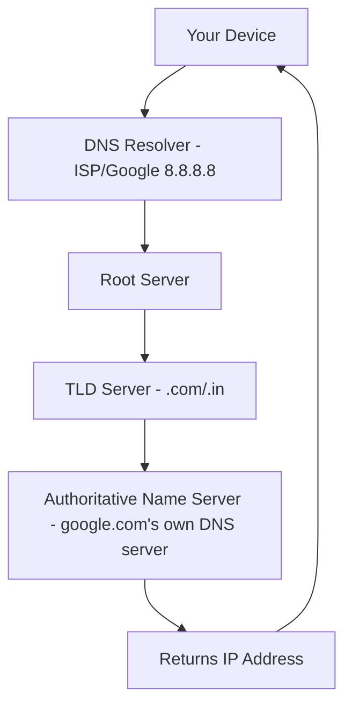
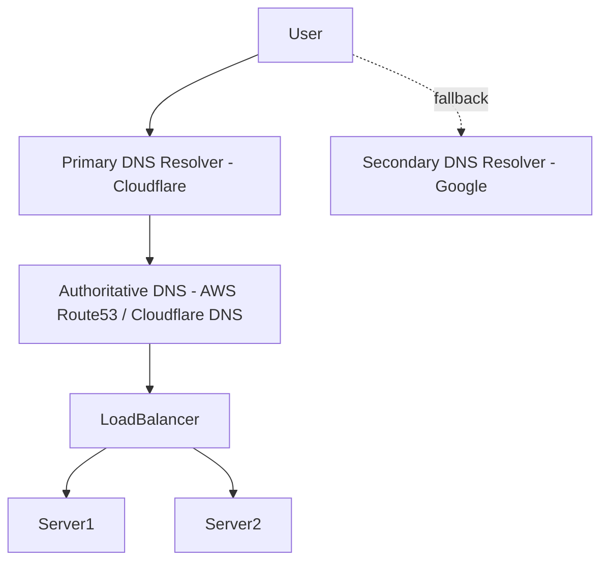

# 📘 MODULE 1 — Computer Networking
## Chapter 2: DNS (Domain Name System)

---

## 1. Introduction

Bhai, pichle chapter mein humne dekha tha ki jab tum `google.com` type karte ho, sabse pehla step hota hai — **DNS Lookup**. Is chapter mein hum wahi cheez deeply samjhenge: **DNS kya hai, kaise kaam karta hai, aur internally kya hota hai jab tum ek naam type karte ho aur browser ko IP address mil jaata hai.**

Ye topic itna important hai ki agar interview mein tumse pucha jaye "google.com type karne ke baad kya hota hai" (ye ek **classic MAANG question** hai), toh DNS ka detailed answer expected hota hai.

---

## 2. Why This Topic Exists

Computers sirf numbers (IP addresses) se ek dusre ko pehchante hain — jaise `142.250.183.14`. Lekin insaan ke liye numbers yaad rakhna mushkil hai. Tum `142.250.183.14` yaad nahi rakh sakte, lekin `google.com` easily yaad rakh lete ho.

Toh problem ye hai: **hume ek translation system chahiye jo naam ko number mein convert kare** — bilkul waise jaise tumhare phone mein Contacts app naam se number dhundh deta hai, tumhe number yaad rakhne ki zaroorat nahi.

DNS yahi translation system hai — **"Internet ki Phonebook"**.

---

## 3. Real Life Problem

Socho tumhare paas Contacts app nahi hai phone mein. Har baar kisi ko call karne ke liye tumhe unka 10-digit number yaad rakhna padega. Apne 50 dosto ke numbers yaad rakhna practically impossible hai.

Isi tarah, agar DNS na ho, toh tumhe har website ke liye uska IP address yaad rakhna padega — Google ke liye alag number, Facebook ke liye alag, tumhare AYUSH portal ke liye alag. Impossible.

---

## 4. Real Life Analogy — Phone Contacts / Directory

| Real World | DNS |
|---|---|
| Contact Name ("Mummy") | Domain Name (google.com) |
| Actual Phone Number | IP Address |
| Contacts App | DNS Resolver |
| Telecom company ka central database | DNS Servers |
| Naya number save karna | DNS Record add karna |
| Number change hone pe contact update karna | DNS Record update (TTL expire hone pe) |

Ek aur analogy: **Library ka Index Card System**. Purane zamane mein library mein books dhundhne ke liye ek index card catalog hota tha — tum author ka naam batao, wo card tumhe bata deta tha book kaunse shelf, row, aur position pe hai. DNS bhi bilkul yahi karta hai naam se location (IP) dhundhne ke liye.

---

## 5. History

- **1970s-80s**: Shuruaat mein internet chota tha (sirf handful of computers ARPANET pe). Ek single file **`HOSTS.TXT`** hoti thi jisme sab naam-to-IP mappings manually maintain hoti thi, aur Stanford Research Institute (SRI) is file ko centrally manage karta tha.
- Jaise-jaise network badhta gaya, ye single file approach fail hone laga — har computer ko baar-baar ye file download karni padti thi, aur ye scale hi nahi kar sakti thi lakho computers ke liye.
- **1983**: Paul Mockapetris ne **DNS (Domain Name System)** invent kiya — ek **distributed, hierarchical system** jisme koi ek single file/server sab kuch handle nahi karta, balki responsibility layers mein baati gayi.
- Aaj DNS duniya ka sabse critical distributed system hai — agar DNS thodi der ke liye down ho jaye, toh poora internet "down" jaisa lagta hai (chahe actual servers chal rahe ho).

---

## 6. Evolution

```
HOSTS.TXT (single centralized file)
     ↓ (scaling problem - too many manual updates)
DNS invented (1983) - distributed hierarchy
     ↓
Root Servers + TLD Servers + Authoritative Servers structure
     ↓
DNS Caching introduced (performance ke liye)
     ↓
DNSSEC (Security extension - spoofing se bachne ke liye)
     ↓
DNS over HTTPS/TLS (DoH/DoT) - privacy ke liye (aaj ka trend)
```

---

## 7. Terminologies

- **Domain Name**: Human-readable naam (google.com, ayushportal.gov.in)
- **DNS Resolver**: Wo system jo tumhari query leke jawab dhundhta hai (usually tumhara ISP ya Google's 8.8.8.8, Cloudflare's 1.1.1.1)
- **Root Server**: DNS hierarchy ka sabse top level — 13 logical root server clusters duniya bhar mein hain
- **TLD (Top Level Domain) Server**: `.com`, `.in`, `.org` jaise extensions ko handle karne wale servers
- **Authoritative Name Server**: Wo server jiske paas actual final answer hota hai kisi specific domain ke liye
- **DNS Record**: Entry jo batati hai domain ka kya data hai
  - **A Record**: Domain → IPv4 address mapping
  - **AAAA Record**: Domain → IPv6 address mapping
  - **CNAME Record**: Ek domain ko dusre domain ka alias banana
  - **MX Record**: Mail server ki information (email routing ke liye)
  - **TTL (Time To Live)**: Kitni der tak ek DNS record cache mein rakha ja sakta hai (seconds mein)
- **Recursive Query**: Jab resolver khud pura kaam karke final answer dhundh ke deta hai
- **Iterative Query**: Jab server sirf "agla kahan pucho" bata deta hai, poori chain khud resolver traverse karta hai

---

## 8. Architecture — DNS Hierarchy



DNS ek **tree-like hierarchical structure** hai:

```
                    "." (Root)
                   /    |    \
                .com   .in   .org
                /        |      \
          google.com  gov.in   wikipedia.org
```

Har level apni responsibility handle karta hai — koi bhi ek server sab kuch nahi jaanta, ye **distributed knowledge** hai.

---

## 9 & 10. Internal Working — Step by Step (Movie Style)

Jab tum browser mein `www.ayushportal.gov.in` type karte ho:

```
STEP 1: Browser Cache Check
   ↓ Browser check karta hai - "kya maine ye pehle already resolve kiya hai?"
   ↓ (Agar TTL abhi expire nahi hua, toh cached IP turant use ho jaata hai - DNS lookup skip)

STEP 2: OS Cache Check
   ↓ Agar browser cache mein nahi mila, OS (Windows/Linux/Mac) ka apna DNS cache check hota hai

STEP 3: Resolver Query (Recursive Resolver)
   ↓ Agar wahan bhi nahi mila, request jaati hai tumhare configured DNS Resolver ko
   ↓ (Ye usually tumhare ISP ka resolver hota hai, ya tumne manually set kiya ho - jaise 8.8.8.8)

STEP 4: Resolver → Root Server
   ↓ Resolver puchta hai Root Server se: "www.ayushportal.gov.in ka IP kya hai?"
   ↓ Root Server jawab deta hai: "Mujhe exact IP nahi pata, lekin .in TLD server se pucho"

STEP 5: Resolver → TLD Server (.in)
   ↓ Resolver ab .in TLD server se puchta hai
   ↓ TLD Server bolta hai: "gov.in ke liye Authoritative Server ye hai, wahan pucho"

STEP 6: Resolver → Authoritative Name Server
   ↓ Ye woh server hai jo ayushportal.gov.in ka actual owner/host manage karta hai
   ↓ Ye final answer deta hai: "IP address hai: 103.X.X.X"

STEP 7: Resolver caches the answer + returns to browser
   ↓ Resolver is answer ko apne cache mein store karta hai (TTL ke duration tak)
   ↓ Browser ko IP address mil jaata hai

STEP 8: Browser ab is IP se TCP connection banata hai
   ↓ (Ye agla chapter hai - TCP Handshake)
```

**Important**: Ye poora process usually **10-50 milliseconds** mein complete ho jaata hai — itna fast ki tumhe pata bhi nahi chalta ki itni saari servers involve hui!

---

## 11. Visualization

```
[Browser Cache] --miss--> [OS Cache] --miss--> [Recursive Resolver]
                                                       |
                    +----------------------------------+
                    |
                    v
              [Root Server] --"pucho .in se"-->
                    |
                    v
            [TLD Server (.in)] --"pucho gov.in authoritative se"-->
                    |
                    v
       [Authoritative Server] --"yaha hai IP: 103.X.X.X"-->
                    |
                    v
              [Back to Resolver - caches it]
                    |
                    v
              [Back to Browser]
```

---

## 12. Memory Flow

- DNS responses **cache** mein store hote hain multiple levels pe (Browser, OS, Resolver) — ye RAM mein hota hai, disk pe nahi (fast access ke liye).
- Har cached entry ke saath **TTL (Time To Live)** attached hota hai — jaise ek expiry timer. Jab TTL khatam ho jaata hai, entry cache se automatically remove ho jaati hai, aur agli baar fresh lookup hoga.
- Ye caching hi hai jo DNS ko itna fast banata hai — agar har request pe root server tak jaana pade, poora internet slow ho jaayega.

---

## 13. Request Flow

```
User types URL
   → Browser Cache Check
      → OS Cache Check
         → Resolver Query
            → Root → TLD → Authoritative
               → IP Address Returned
                  → Cached at all levels
                     → Browser proceeds to TCP connection
```

---

## 14. Network Flow

DNS queries mostly **UDP** protocol use karte hain (Port 53) kyunki DNS request/response chota hota hai aur speed priority hai — agar packet kho bhi jaye, resolver dobara try kar sakta hai (UDP ke bare mein detail agle chapter mein). Agar response bada ho (jaise DNSSEC ke saath), toh TCP bhi use hota hai.

---

## 15. Data Flow

```
Domain Name (string: "google.com")
   ↓ (Query format mein convert - DNS message format)
DNS Query Packet
   ↓ (Network se travel - UDP Port 53)
DNS Server Response
   ↓ (IP Address extract hota hai response se)
IP Address (numeric: 142.250.183.14)
   ↓ (Ye ab browser use karta hai TCP connection banane ke liye)
```

---

## 16. Thread Flow

Production-grade DNS resolvers (jaise Cloudflare's 1.1.1.1 ya Google's 8.8.8.8) millions of queries per second handle karte hain. Ye highly **concurrent, non-blocking architecture** use karte hain — ek single thread hazaro queries ko simultaneously handle kar sakta hai kyunki DNS lookups I/O-bound operations hain (wait karna padta hai network response ka), CPU-bound nahi.

---

## 17. CPU Usage

DNS lookups generally CPU-light hote hain. Extra CPU tab lagta hai jab:
- **DNSSEC validation** ho rahi ho (cryptographic signature verify karna)
- Resolver bahut saare concurrent requests parse kar raha ho

---

## 18. Disk Usage

- Authoritative DNS servers apne zone files (domain records) disk pe store karte hain.
- Bade resolvers (jaise 8.8.8.8) persistent cache bhi disk pe rakh sakte hain reliability ke liye, though primary cache RAM mein hoti hai speed ke liye.

---

## 19. Behind the Scenes

- Duniya bhar mein sirf **13 logical Root Server clusters** hain (named A se M), lekin ye actually thousands of physical servers hain jo **Anycast** technique use karke duniya bhar mein distribute hain — jab tum root server ko query karte ho, tumhe automatically **geographically nearest** copy mil jaati hai.
- Ye design isliye hai taaki agar ek jagah ka server down ho jaye, poori duniya ka DNS na atke.

---

## 20. Advantages

- Human-friendly naam use kar sakte hain, numbers yaad nahi rakhne padte.
- Distributed system hai — no single point of failure (agar sahi design ho).
- Caching ki wajah se bahut fast hai.
- Flexible — ek domain ka IP change ho sakta hai bina domain naam badle (jaise server migrate karo, users ko pata bhi nahi chalega).

## 21. Disadvantages

- Extra lookup step add karta hai (though usually milliseconds mein hi ho jaata hai).
- **DNS Spoofing/Cache Poisoning** jaisa attack possible hai agar security (DNSSEC) na ho.
- TTL caching ki wajah se agar tum IP change karo, kuch users ko purana (stale) IP milta rehta hai jab tak unka cache expire na ho.

## 22. Trade-offs

- **Caching vs Freshness**: Lamba TTL = fast (kam lookups) but agar IP change ho toh update slow propagate hoga. Chota TTL = fresh updates fast but zyada lookups (thoda slower average experience).
- **UDP vs TCP for DNS**: UDP fast hai but bada response truncate ho sakta hai; TCP reliable hai but slower.

---

## 23. Common Mistakes

1. Sochna ki DNS change turant sab jagah reflect ho jaata hai — actually TTL expire hone tak purana cached data use ho sakta hai (isiliye deployment mein "DNS propagation delay" hota hai, jo few minutes se 48 hours tak ho sakta hai).
2. Production mein bahut chota TTL rakhna bina reason ke — isse unnecessary lookups badh jaate hain, performance thodi slow ho sakti hai.
3. DNS ko "database" samajhna — actually ye ek distributed lookup/caching system hai, transactional database nahi.

---

## 24. Best Practices (Production Perspective)

- Server migrate karne se pehle TTL ko temporarily kam kar do (jaise 1 hour se 5 minutes), taaki jab tum IP change karo, users jaldi naya IP pick kar lein.
- Critical services ke liye multiple DNS providers use karo (redundancy) taaki agar ek DNS provider down ho jaye, dusra kaam kare.
- DNSSEC enable karo production domains pe, spoofing attacks se bachne ke liye.

---

## 25. Production Architecture Example



Bade companies apna domain ka authoritative DNS managed services (AWS Route 53, Cloudflare DNS, GoDaddy DNS) pe host karte hain jo automatically geographically distributed hote hain aur high availability guarantee karte hain.

---

## 26. Industry Usage

- **Netflix**: DNS-based load balancing use karta hai users ko nearest data center pe route karne ke liye.
- **Cloudflare**: 1.1.1.1 jaisa fast, privacy-focused public DNS resolver operate karta hai jo duniya ka ek sabse fast resolver hai.
- **AWS Route 53**: Ek popular managed DNS service hai jo health checks ke basis pe automatically traffic ko healthy servers pe route kar sakta hai (DNS failover).

---

## 27. Interview Questions

**Easy:**
1. DNS ka full form kya hai aur ye kya karta hai?
2. A Record aur CNAME Record mein kya difference hai?

**Medium:**
3. TTL kya hota hai aur ye kyun important hai?
4. Recursive query aur Iterative query mein kya difference hai?

**Hard:**
5. DNS caching ke multiple levels explain karo (browser, OS, resolver) aur ye performance ko kaise improve karta hai.
6. DNS Cache Poisoning attack kya hota hai aur DNSSEC ise kaise prevent karta hai?

**Expert:**
7. Explain karo Anycast routing kaise root DNS servers ko globally distribute karne mein help karta hai bina unki IP address change kiye.

**Scenario:**
8. Tumne apna AYUSH portal ka server migrate kiya naye IP pe, lekin kuch users ko abhi bhi purana server dikh raha hai — kya reason ho sakta hai aur kaise fix karoge?
(Answer: TTL abhi expire nahi hua unke cached DNS record ka — future migrations ke liye pehle se TTL kam kar dena chahiye)

---

## 28. Assignments

- **Easy**: `nslookup google.com` (Windows) ya `dig google.com` (Linux/Mac) run karke dekho A record kya milta hai.
- **Medium**: `dig google.com +trace` run karo aur dekho poori hierarchy (root → TLD → authoritative) kaise traverse hoti hai step by step.
- **Hard**: Apne domain (agar ho) ke DNS records check karo (A, MX, CNAME) — kisi bhi DNS lookup tool (like `dig` ya online tool) se.
- **Production Level**: Socho tumhare AYUSH portal ka traffic suddenly ek city mein bahut zyada badh gaya - DNS-level solution kya ho sakta hai users ko nearest healthy server pe route karne ke liye?

---

## 29. Cheat Sheet

| Term | One-liner |
|---|---|
| DNS | Naam se IP dhundhne wala distributed system |
| A Record | Domain → IPv4 mapping |
| CNAME | Domain ka alias |
| TTL | Cache kitni der valid rahegi |
| Resolver | Wo jo query resolve karta hai (usually ISP/public DNS) |
| Root Server | Hierarchy ka top level |
| Authoritative Server | Final source of truth for a domain |

---

## 30. Summary

DNS ek **distributed, hierarchical, caching-based system** hai jo human-readable domain names ko machine-readable IP addresses mein convert karta hai. Ye multiple levels (Root → TLD → Authoritative) se guzarta hai, lekin caching ki wajah se practically bahut fast (milliseconds) hai. Production systems mein DNS ka smart use (low TTL during migration, DNSSEC, multiple resolvers) reliability aur security dono improve karta hai.

---

## 31. Revision Notes

- DNS = Internet ki Phonebook
- Hierarchy: Root → TLD → Authoritative
- Caching multiple levels pe hoti hai (Browser, OS, Resolver)
- TTL decide karta hai cache kitni der valid rahegi
- UDP Port 53 mostly use hota hai (fast)
- DNSSEC = security layer against spoofing

---

### 🔜 Next Chapter
**Chapter 3: TCP vs UDP** — DNS lookup ke baad, IP mil chuka hai, ab actual connection kaise banta hai data bhejne ke liye. TCP ka 3-way handshake, reliability mechanism, aur UDP kyun fast hota hai — sab kuch deeply.

Bata do bhai — TCP/UDP pe chalein, ya HTTP/HTTPS pehle chahiye?
